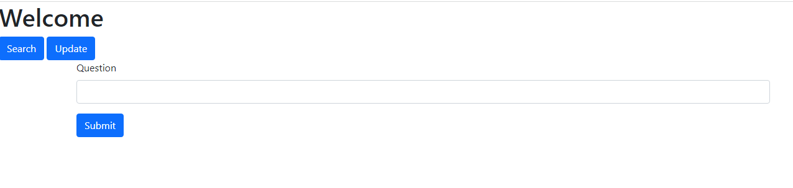
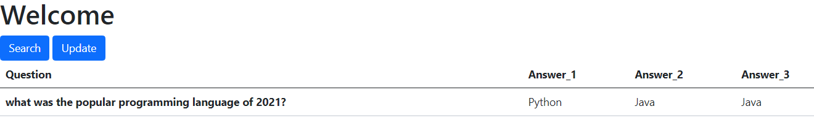
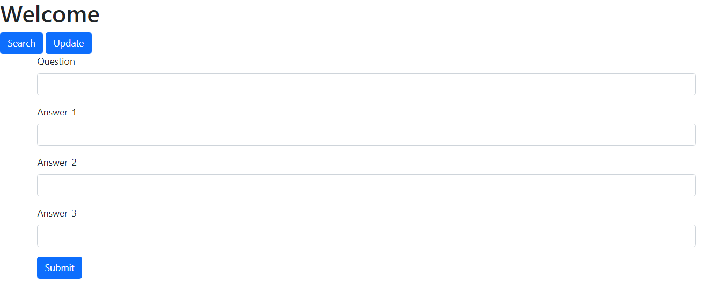

## Link to App-https://question-bank-prashant.herokuapp.com/

Problem statement:
Map the student question with Question column values in DB and output with the respective answers onto the frontend.
(Sample please find the attached image to understand how it should look in the frontend)

Please find the two functionalities to be done:
Kindly have two buttons in the front end Search and Update.
> Search will have Question as input 
   for search only question will be sent as input and output will be all three answers.

Input (Question):
When a student gives input in the question box in the frontend then the Question should be matched from DB and respective answers to be retrieved if it matches any question.
--If there is no answer in DB for that question then just display "NA" and store that question in DB with empty answer values.
Output (Answer 1, Answer 2, Answer 3)

> Update will have Question and their respective answers to be sent from frontend.
   for Update Question and all the answers will be sent as input and stored in DB.
  
Input (Question, Answer1, Answer2, Answer3)
Output: "DB is updated with new data"(message in frontend)

# Search (Home) Page

# Search Result Page

# Udate Page

